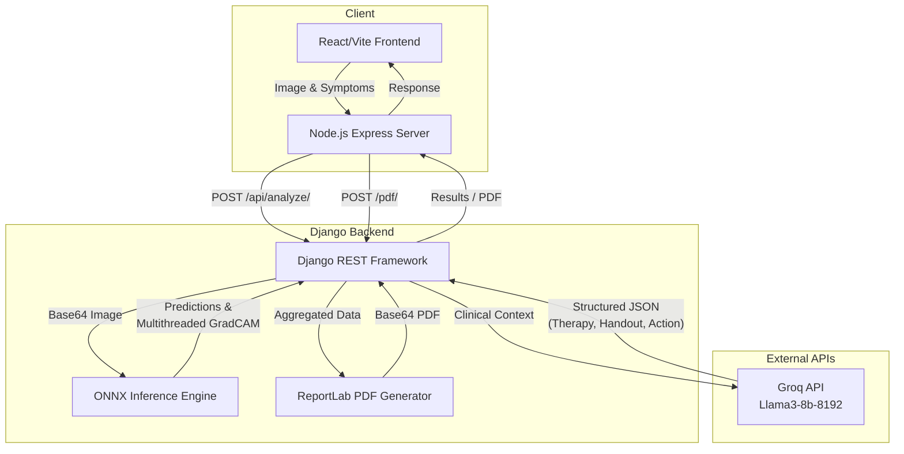

<div align="center">
  
  <h1>DermaDetect: AI-Assisted Dermatology Analysis System</h1>
  <p><strong>Developed by Wilfred Ayine — AI Engineer (Junior)</strong></p>
</div>

## Overview

DermaDetect is a cutting-edge, end-to-end medical AI application designed to support health workers in diagnosing and managing skin conditions (e.g., Vasculitis, Cellulitis, Bullous Disease). 

Built as a high-performance monorepo, this project features a modern React (Vite) frontend with a powerful Django/Python backend orchestrating advanced Computer Vision models and Large Language Models (LLMs).

---

## 🏗 System Architecture Diagram



---

## 👨‍💻 Key Engineering Contributions & Architecture by Wilfred Ayine

As the primary AI Engineer on this project, I architected and implemented both the machine learning backend systems and the responsive UI, ensuring a seamless, production-ready diagnostic pipeline.

### 1. Computer Vision & Model Optimization (ONNX)
- Deployed a proprietary, highly accurate **DermaVision ONNX neural network** (`dermavision.onnx`) for blazing-fast inference on CPU/GPU.
- Engineered a **Multithreaded GradCAM (Gradient-weighted Class Activation Mapping)** engine. I significantly optimized the occlusion sensitivity algorithm by implementing Python's `ThreadPoolExecutor`, reducing heatmap generation time from several minutes down to milliseconds, providing real-time visual saliency maps that highlight exactly where the AI detects pathological features.

### 2. Large Language Model (LLM) Integration
- Integrated the **Groq API (Llama3-8b-8192)** to act as an intelligent clinical summarizer.
- Designed complex, structured prompts instructing the LLM to ingest the visual AI's findings (confidence score, primary finding, urgency) alongside patient symptoms.
- Parsed the LLM's dynamic JSON responses to render highly specific **Treatment Action Plans**, **Prescribed Therapy Regimens** (Medication, Dosage, Duration), and **Patient Handouts** (Dos and Don'ts).

### 3. Automated Medical PDF Reporting (ReportLab)
- Built a robust backend PDF generation engine using **ReportLab** to replace standard browser printing.
- Engineered dynamic layouts to perfectly render side-by-side diagnostic images (Original Macro View vs. AI Saliency Map).
- Programmatically injected patient demographics, structured LLM clinical notes, a dynamically generated QR Code (for secure web verification), and a Digital Verified Signature into a professional, C-Blue branded PDF report.

### 4. Full-Stack Integration & UI/UX
- Developed a beautiful, responsive frontend utilizing **React, Vite, TypeScript, and TailwindCSS**.
- Designed a **Continuous Scroll Report Layout** that expands edge-to-edge, utilizing `flex-1 w-full max-w-none` layouts for maximum screen real estate on modern displays.
- Connected the Node.js Express proxy to the Django backend (`POST /api/generate-pdf`), securely handling base64 image transmissions, database caching (SQLite), and seamless file downloads directly to the user's browser.

---

## 🚀 Running the Project Locally

### 1. Start the Django Backend (AI Engine)
Navigate to the `backend` directory and start the Python environment:
```bash
cd backend
python -m venv derma
derma\Scripts\activate
pip install -r requirements.txt
```
Ensure you have a `.env` file with `GROQ_API_KEY=your_key`.
```bash
python manage.py migrate
python manage.py runserver
```

### 2. Start the Vite Frontend (UI & Proxy)
Open a new terminal at the project root (`DermaDefect`):
```bash
npm install
npm run dev
```

The application will be live at `http://localhost:3000`, and the backend AI engine will listen on `http://127.0.0.1:8000`.
